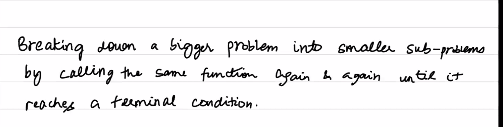

Breaking down a bigger problem into smaller sub-problem by calling  the same function again and again until it reaches a terminal condition.

problems:

1. a+b
2. a^b%c
3. given a string s check if s is a palindrome